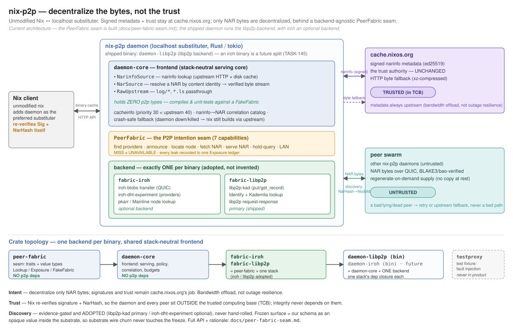
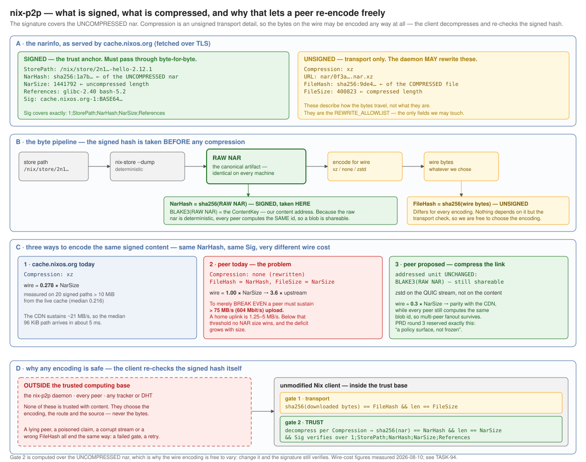

# nix-p2p

A decentralized Nix binary cache. A localhost substituter daemon speaks the
standard binary-cache HTTP API, passes signed metadata through from
cache.nixos.org, and fetches NAR payloads from peers it discovers over a
decentralized DHT — every payload hash-verified against the signed NarHash. An
unmodified Nix client re-verifies the signature and NarHash itself, so the daemon
and every peer stay **outside the trusted computing base**: a hostile or broken
peer costs a retry, never a bad store path.

The aim is **bandwidth offload for cache.nixos.org — decentralizing the bytes, not
the trust.** Signing stays the cache's job.

**See it run:** `nix develop` then `just e2e` stands up separate daemon containers
and drives a real `nix build` whose NAR is discovered, resolved, fetched, and
served **from a peer** — no injected addresses, upstream untouched on a hit.

> **Research prototype.** The daemon fronts cache.nixos.org over verified TLS, but has
> not been run against the real cache in a deployment and has not faced a public
> network — no NAT hole-punching, no relay, no residential uplink. It runs on loopback,
> in-process, and single-host rootless-podman containers. Within that scope the
> decentralized path is real end to end: separate daemon containers on isolated
> network namespaces discover a provider, resolve its address, fetch, and serve a
> NAR to an unmodified `nix build` with **no injected addresses**. The addressed
> unit, the claim wire schema, and the discovery key/record are frozen; the
> public-network story (NAT traversal, relay, residential uplinks) is still ahead,
> and the transport tournament is deferred behind getting decentralized discovery
> and robust connectivity solid first.

## Architecture



A stack-neutral **frontend** (`daemon-core`) over a swappable P2P **backend** that
the *binary* chooses — `daemon-libp2p` links one backend and nothing of the other,
proven by its dependency graph. Alongside sits a separate test fixture
(`just independence` keeps the product and the fixture from sharing code, so the
fixture stays an independent witness of wire behaviour). The seam is documented in
`docs/peer-fabric-seam.md`.

**Three seams.** Serving sits behind `NarinfoSource` (narinfo lookup) and `NarSource`
(resolve a signed NarHash to a verified byte stream). All P2P sits behind the
intention-level **`PeerFabric`** seam — *find providers · announce · locate · fetch ·
serve · hold-query · LAN* — so the serving core holds **zero** p2p types.

**libp2p-primary; iroh optional.** iroh is a strong *connectivity* substrate ("dial
an `EndpointId`, get authenticated QUIC bytes") but has **no content-provider
routing**: it answers "*where is this node?*", never "*who has hash X?*". So
**discovery is `libp2p-kad`** — adopted from a robust existing library, not
hand-rolled, and not Kademlia-over-iroh — and **iroh-blobs is an optional transport**
kept for its NAT traversal. Discovery is libp2p-kad regardless of transport. (See
"iroh's shortcomings" in `PRD.md`.)

Crates:

- **`peer-fabric/`** — the seam: capability traits, `Lookup`/`Exposure`, and the
  frozen `ContentKey`/`ProviderRecord` codec + validation oracle. **Zero** p2p-library deps.
- **`fabric-libp2p/`** — the primary backend: the libp2p-kad `ProviderDirectory` +
  `AvailabilityAnnouncer`, a `NodeLocator` (kad peer-routing → dialable address), and
  a libp2p `NarTransfer`/`NarServer` on the same swarm.
- **`fabric-iroh/`** — the optional backend behind the same seam: iroh-blobs
  `NarTransfer`/`NarServer` + pkarr node lookup (`IrohFabric`, with `ProviderDirectory`
  honestly absent — iroh has no content routing).
- **`daemon-core/`** — the stack-neutral frontend: serving core, narinfo/NAR
  correlation, policy, budgets, raw-serve rewrite, upstream fallback. Depends on the
  seam only; **no** p2p-library deps.
- **`daemon-libp2p/`** — the primary thin binary: `daemon_core::run(Libp2pFabric)`, with
  a crate-graph guard proving it links no iroh. (`daemon/` is the interim composite that
  links both backends and drives the container e2e while the per-backend split finishes.)
- **`testproxy/`** — the permanent test fixture: a caching proxy that owns all fault
  injection (latency, errors, corruption, throttling).
- Supporting: `fixtures/` (signed mock cache), `scripts/` (rootless-podman e2e + the
  measurement instrument), `nixos/` (module + VM test).

## Trust and verification



Trust stays where it is. cache.nixos.org signs narinfos; an unmodified Nix client
re-verifies the ed25519 signature and the NarHash; the daemon and every peer are
outside the TCB. A peer serves the **raw** NAR — the addressed unit, `RawNarV1`, the
exact `nix-store --dump` bytes keyed by plain BLAKE3 — verified BLAKE3/bao on arrival
and again by Nix's own signature + NarHash check.

**Frozen surfaces** (deep-reviewed because changing them splits the network, and
pinned in bytes by golden vectors): the addressed unit; the claim wire schema; and
the discovery key + provider record — a `ContentKey` derived from the signed NarHash
and an ed25519-signed `ProviderRecord` stored as an **opaque value**, so the DHT
substrate's own wire format can churn without touching the freeze.

**The open question — do peers beat a CDN?** A peer serves the raw NAR while the CDN
serves a compressed file, so a peer moves more bytes per path and may not beat a fast
CDN on speed until the peer link is itself compressed (an unsigned transport field;
the addressed unit stays the raw NAR). The long tail is where a CDN is strong and
swarms are weak. Whether peers usefully beat or supplement a CDN as a byte source is
treated as a thesis to measure, not a premise. **Early measurement says supplement,
not beat:** on shaped links a peer's raw NAR runs several times the CDN's compressed
bytes and loses at every size raw, while fast negotiated link-compression closes most
of that gap back toward parity — so on the evidence so far peers look like a bandwidth
*supplement* to the CDN (which is exactly the stated aim), not a replacement. The
measurement instrument is a first-class part of the project; true public-network and
public-swarm results are still out.

## What is

- **Decentralized content discovery.** A node announces a signed provider record
  under a NarHash-derived key; another node resolves "who has this NAR?" through the
  libp2p-kad DHT with no injected answer. The *found / miss / unavailable* outcomes
  are distinct, and there is no "list my holdings" call at all — no enumeration, by
  construction.
- **Decentralized address discovery — nothing injected.** A discovered provider's
  dial address is resolved through libp2p-kad peer-routing; the shipped path is never
  handed the address. Proven *load-bearing* on isolated container network namespaces:
  break only the address resolution while the provider stays alive and reachable, and
  the fetch correctly falls back to upstream — so a peer-served result genuinely
  required the decentralized resolution.
- **The daemon uses it end-to-end, across real containers.** Separate daemon
  containers — a bootstrap kad router that holds no content, a serving provider, and a
  consumer told only the bootstrap — let the consumer discover the provider via kad,
  resolve its address, fetch, verify, and serve a byte-identical NAR to a real
  `nix build`: zero upstream NAR egress on a hit, a clean upstream fallback on a miss.
- **Peer transfer over two backends,** each BLAKE3/bao-verified on arrival: iroh-blobs
  whole-NAR over QUIC (a real `nix build` served from a peer across container network
  namespaces — a corrupt peer fails the build, a dead peer falls back to upstream) and
  libp2p request-response over the same swarm as discovery.
- **The backend is the binary.** The serving core is a stack-neutral crate; the primary
  binary links only libp2p, guaranteed by its dependency-graph guard — the choice of
  backend is a compile-time fact, not a runtime flag, so tests and tournament runs can
  never conflate the two stacks.
- **Multi-provider robustness.** Several holders per NAR with fail-over to the next when
  one is dead; ≥3 independent bootstrap nodes with resolution surviving the loss of any
  one; signed provider records with monotonic-sequence replay/rollback rejection and
  signed-withdrawal tombstones; and a bounded provider index an attacker cannot grow
  without limit by announcing arbitrary keys.
- **A transparent substituter proxy:** `nix-cache-info` semantics, a narinfo disk
  cache, the NAR correlation catalog, correct serving of a raw NAR under a compressed
  upstream narinfo (the hit is rewritten to match the bytes it serves), multi-daemon
  chains, the additive-invariant crash behaviour (daemon dead or killed mid-transfer →
  `nix build` still succeeds via fallback, the store never corrupted), a NixOS module +
  VM test.
- **A supply-integrity floor.** Before a node will advertise that it holds a NAR it
  verifies that `sha256(nix-store --dump <path>)` equals the signed NarHash — at the
  index and again at the shipped announce site — so a mis-registered path is quarantined
  rather than announced as a false claim; and produced bytes are BLAKE3-rechecked against
  the announced content before they leave the node.
- **Fronts the real cache.nixos.org over verified TLS.** The daemon speaks HTTPS to the
  upstream cache with full certificate-chain and hostname verification and no skip-verify
  path in a production build; the test fixture fronts it too, over a deliberately
  *disjoint* TLS stack so the product and the fixture stay independent witnesses of wire
  behaviour.
- **Regenerate-on-demand supply from a live `/nix/store`.** The shipped provider (with
  `--libp2p-provide-store`) serves any announced store path by regenerating its raw NAR from
  `/nix/store` on demand — a supervised, cancellation-safe process group, nothing held at rest,
  no enumeration — and the announce is gated by the supply-integrity floor above, so it can only
  advertise a path the index actually verified. Production runs off the swarm poll loop, so a
  large serve never stalls discovery.
- **True streaming transfer.** NARs move over a raw libp2p stream: the fetcher aborts the
  instant a transfer exceeds its declared size — mid-stream, not after buffering — enforces an
  inter-chunk idle bound, and a bounded in-flight ceiling caps concurrent serves, while every
  byte is still BLAKE3/bao-verified before the build accepts it.

## What is not yet

- **A public network.** NAT hole-punching, relay for residential peers, and running
  against the real cache.nixos.org over a public network are future work; today it is
  single-host loopback and containers.
- **The container-packaged store-serve proof.** Serving from a live `/nix/store` is proven
  in-process and across two swarms; the multi-container end-to-end of that exact journey — a
  provider serving a store path it never held as a file, fetched by a consumer over the DHT —
  is the one deferred piece.
- **The iroh optional-transport journey.** iroh transfer works; its decentralized
  public-node discovery / no-address connection, and the iroh-versus-libp2p transport
  tournament that decides whether iroh's NAT traversal earns its place, are in progress.
- **Restart-durable state in the shipped daemon — now wired, gated on a state dir.**
  With `--libp2p-state-dir <dir>` the shipped daemon runs in durable mode: the directory is
  the single anchor for both the node's **identity** (a state-dir-only restart comes back as
  the *same* NodeId, so it can still supersede and withdraw its own records) and its
  **sequence floor** — it reloads the anti-rollback floor on restart and allocates
  provider-record sequences durably (a restarted provider mints a strictly-newer sequence
  instead of re-minting `1` and self-rolling-back), persisting the sequence fail-closed
  *before* publishing (save-before-publish, parent-dir fsynced). Without the flag a node is
  session-scoped by choice (fresh identity, re-earned floor) and providers say so loudly.
  What remains is *hardening* the durable floor (fail-closed eviction bound, consumer-side
  TTL-cap enforcement, durable-reload sweep/cap, fail-closed consumer durability, a
  shared-state-dir advisory lock, save-before-publish for withdrawals, and per-line
  persistence integrity) — tracked as the record-lifecycle hardening follow-up.
- **Deeper swarm dynamics:** per-chunk (bao) stream verification and true serve-side
  passthrough (the stream currently verifies at completion and buffers before shipping),
  hedged/prefetch fetches, and eclipse/sybil bounds beyond the current replay/rollback/DoS
  guards.
- **A verdict on the value thesis:** whether peers beat a CDN is unmeasured on a real
  network.

## Development

Everything runs in the pinned flake devshell; the Justfile refuses any other
toolchain.

```sh
nix develop
just            # list gates

just build      # cargo build, all targets
just lint       # clippy -D warnings, rustfmt, ruff, independence + source guards
just test       # cargo test — incl. the multi-node discovery + address-resolution +
                # transfer + daemon-integration tests — plus the fixture and measurement gates
```

Slow tier (containers / VMs):

```sh
just e2e         # rootless-podman subset, incl. the iroh peer-served build and the
                 # multi-daemon libp2p discover→resolve→fetch→serve journey
just e2e-full    # every e2e scenario
just e2e-vm      # NixOS VM test (needs /dev/kvm)
just measure     # egress / latency / gap report
just profile     # p2p resource / throughput report
```

`nix flake check` re-runs build/lint/test in the CI sandbox.

## Documents

- **`PRD.md`** — the durable design record: essence, decisions, iroh's shortcomings,
  the irreversibility map, risks, the tournament contract.
- **`docs/peer-fabric-seam.md`** — the `PeerFabric` seam design.
- **`TESTING.md`** — what "good" and "bad" observably mean; the oracles the gates
  enforce.
- **`figures/`** — architecture overviews (the two above; `fig-arch-1`/`-2` zoom into
  the wave-1 daemon and the test harness).
- **`backlog/`** — the task tracker (use the `backlog` CLI, not direct edits).

## References

Prior art and the problem this addresses:

- [Peer-to-peer binary cache RFC / working-group poll](https://discourse.nixos.org/t/peer-to-peer-binary-cache-rfc-working-group-poll/29568)
  (NixOS Discourse) — polls the community on a decentralized binary cache motivated by
  CDN bandwidth cost; the availability / untrusted-peer / sharding objections raised
  there are the ones this design answers rather than assumes away.
- [Migration of S3 bucket payments to the Foundation](https://github.com/NixOS/foundation/issues/86)
  (NixOS/foundation) — the storage-cost side of the same problem, cataloguing
  alternatives from distributed stores to decentralized mirrors.

Where this differs from most such proposals: it decentralizes the **bytes only** and
leaves trust exactly where it is, and it targets *bandwidth* rather than storage.

## AI assistance

This project's code and documentation were developed with substantial assistance from
an AI coding agent (Anthropic's Claude). By project convention individual commits do
**not** carry AI co-author trailers — the disclosure lives here instead. Design
decisions, the trust model, and every merge remain human-owned; the AI implemented
against a human-reviewed backlog under gated, test-grounded review.

## License

MIT — see `LICENSE`.
